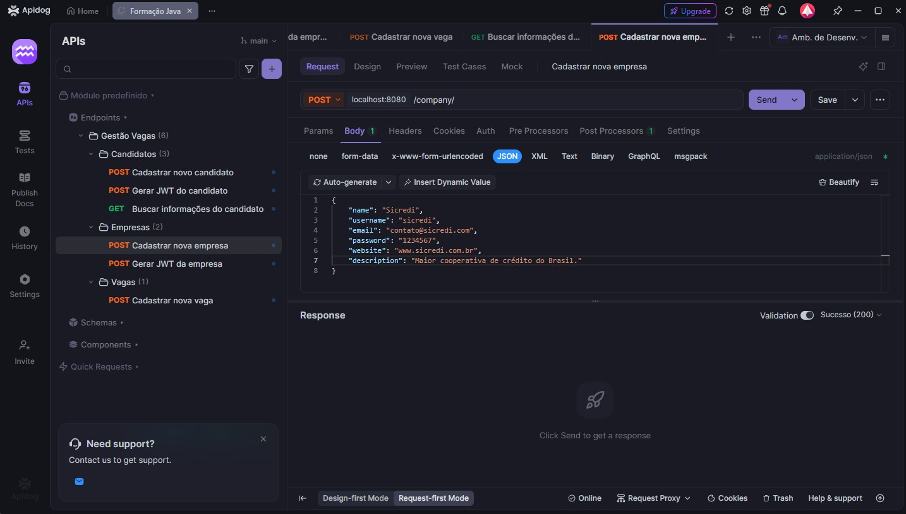
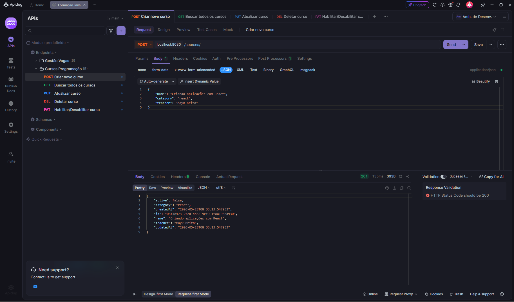

# Formação Java 2024 - Rocketseat

## 📋 Descrição
Este repositório contém todos os materiais e projetos desenvolvidos na [Formação Java 2024](https://app.rocketseat.com.br/journey/java) da Rocketseat.

## 📑 Índice

- [Módulo 01: Fundamentos do Java](#-módulo-01-fundamentos-do-java)
- [Módulo 02: Java Collections](#-módulo-02-java-collections)
- [Módulo 03: Maven e JDBC](#-módulo-03-maven-e-jdbc)
- [Módulo 04: Fundamentos do Spring Boot](#-módulo-04-fundamentos-do-spring-boot)
- [Módulo 05: Rotas, Autenticação e Autorização](#-módulo-05-rotas-autenticação-e-autorização)

---

## 💻 Módulo 01: Fundamentos do Java

Este módulo cobre os fundamentos essenciais da linguagem Java, desde sintaxe básica até conceitos avançados de programação orientada a objetos.

### 📚 Tópicos Abordados

#### 1. **Sintaxe Básica e Primeira Classe**
- Estrutura básica de uma classe Java
- Método `main`
- Declaração de variáveis e tipos primitivos
- Primeiro programa em Java

#### 2. **Tipos Wrappers (je05_tipos_wrappers)**
- Classes wrapper para tipos primitivos (Integer, Double, Boolean, etc.)
- Conversão entre tipos primitivos e objetos
- Autoboxing e unboxing

#### 3. **Operadores (je06_operadores)**
- **Operadores Aritméticos**: +, -, *, /, %
- **Operadores de Atribuição**: =, +=, -=, *=, /=
- **Operadores Relacionais**: ==, !=, <, >, <=, >=
- **Operadores Lógicos**: && (AND), || (OR), ! (NOT)
- **Operadores Unários**: ++, --, +, -
- **Operador Ternário**: condição ? valor_se_verdadeiro : valor_se_falso

#### 4. **Documentação e Comentários (je07_documentacao)**
- Comentários de linha única (//)
- Comentários de múltiplas linhas (/* */)
- JavaDoc para documentação de classes e métodos
- Boas práticas de documentação de código

#### 5. **JavaBeans (je08_javabeans)**
- Convenções JavaBeans
- Getters e Setters
- Encapsulamento de dados

#### 6. **Controle de Fluxo Condicional (je09_controle_fluxo)**
- Estruturas `if`, `else`, `else if`
- Estrutura `switch/case`
- Exemplos práticos: Caixa Eletrônico, Resultado Escolar, Sistema de Medidas

#### 7. **Estruturas de Repetição (je10_controle_fluxo_repeticao)**
- **for**: Laço controlado por contador
- **while**: Laço com condição pré-verificada
- **do-while**: Laço com condição pós-verificada
- **break**: Interromper execução do laço
- **continue**: Pular para próxima iteração

#### 8. **Tratamento de Exceções (je11_controle_fluxo_excecao)**
- Blocos `try/catch/finally`
- Tratamento de exceções com Scanner
- InputMismatchException
- Exceções personalizadas
- Projeto prático: AboutMe (entrada de dados do usuário)

#### 9. **Programação Orientada a Objetos (je12_poo)**
- Classes e Objetos
- Instanciação
- Construtores
- **Enums**: Criação e uso de tipos enumerados (EstadoBrasileiro)
- **Comparação de Objetos**: equals(), hashCode(), comparação de referências vs valores
- Atributos e métodos de instância

#### 10. **Classes Essenciais (je13_classes_essenciais)**
- **Classes String**: Métodos de manipulação de strings (concat, toLowerCase, toUpperCase, split)
- **StringBuilder**: Construção eficiente de strings
- **Classes Numéricas**: Wrappers e conversões
- **Scanner**: Leitura de dados do usuário
- **PrintStream**: System.out.println, System.err

#### 11. **Pilares da POO (je14_pilares_poo)**
- **Abstração**: Classes abstratas (ServicoMensagemInstantanea)
- **Herança**: Extensão de classes (FacebookMessenger, MSNMessenger, Telegram)
- **Polimorfismo**: Interfaces e implementações
- **Encapsulamento**: Modificadores de acesso

#### 12. **Java Time API (je15_java_time)**
- **LocalDate**: Trabalhando com datas
- **LocalTime**: Trabalhando com horas
- **LocalDateTime**: Combinação de data e hora
- **DateTimeFormatter**: Formatação de datas
- Manipulação de datas (plus, minus, isAfter, isBefore)
- Parsing e formatação de strings para datas

#### 13. **Java NIO - File I/O (je26_java_nio)**
- **Path e Paths**: Manipulação de caminhos de arquivos
- **Files**: Operações de leitura e escrita
- Leitura de arquivos (readAllLines, readAllBytes)
- Escrita de arquivos
- Trabalhando com arquivos CSV (layout delimitado e posicional)
- Projeto: Sistema de Cadastros com leitura/escrita de arquivos

#### 14. **Exceções Avançadas (je27_excessoes)**
- Criação de exceções personalizadas (EstadoValidadeException)
- Hierarquia de exceções
- Blocos try/catch aninhados
- Lançamento de exceções (throw, throws)

#### 15. **Expressões e Formatação (je28_expressoes)**
- **Expressões Simples**: Concatenação de strings
- **String.format()**: Formatação de strings
- **Expressões Avançadas**: Formatação com padrões (s, d, f, t)
- Formatação de números, datas e valores monetários
- Padrões de formatação personalizados

### 🎯 Projetos Práticos

- **Sistema de Livraria**: Projeto completo implementando classes (Autor, Livro, Emprestimo, Biblioteca) com operações de empréstimo e devolução
- **Sistema de Cadastros**: Sistema de leitura e escrita de arquivos usando Java NIO

---

## 📦 Módulo 02: Java Collections

Este módulo aborda as estruturas de dados e coleções do Java, essenciais para manipulação eficiente de conjuntos de dados.

### 📚 Tópicos Abordados

#### 1. **Arrays (je29_arrays/Arrays.java)**
- Declaração e inicialização de arrays
- Arrays unidimensionais
- Iteração sobre arrays (for tradicional e enhanced for)
- Acesso por índice

#### 2. **Listas (je29_arrays/Listas.java)**
- Interface `List` e implementações
- **ArrayList**: Lista dinâmica baseada em array
- Métodos essenciais: add(), remove(), get(), indexOf(), contains(), size()
- Iteração sobre listas

#### 3. **Conjuntos (je29_arrays/Conjuntos.java)**
- Interface `Set` e suas implementações
- **HashSet**: Conjunto sem ordem definida
- **LinkedHashSet**: Conjunto mantendo ordem de inserção
- **TreeSet**: Conjunto ordenado
- Propriedade de unicidade (sem elementos duplicados)

#### 4. **Mapas (je29_arrays/Mapas.java)**
- Interface `Map` e implementações
- **HashMap**: Mapa sem ordem definida
- **LinkedHashMap**: Mapa mantendo ordem de inserção
- **TreeMap**: Mapa ordenado por chave
- Operações: put(), get(), keySet(), values()
- Iteração sobre mapas usando Iterator

#### 5. **Generics (je29_arrays/Generics.java)**
- Tipagem genérica em coleções
- Type safety
- Collections com tipos específicos: `List<String>`, `List<Integer>`
- Métodos úteis: Collections.sort(), Collections.shuffle()
- Vantagens de usar Generics

### 🎯 Conceitos Aprendidos

- Diferenças entre List, Set e Map
- Quando usar cada tipo de coleção
- Performance e complexidade de operações
- Type safety com Generics
- Boas práticas no uso de Collections

---

## 🔧 Módulo 03: Maven e JDBC

Este módulo introduz o gerenciamento de dependências com Maven e a comunicação com bancos de dados usando JDBC.

### 📚 Tópicos Abordados

#### 1. **Apache Maven**
- Estrutura de projeto Maven
- Arquivo `pom.xml` (Project Object Model)
- Gerenciamento de dependências
- Ciclo de vida do Maven (compile, test, package)
- Diretórios padrão (src/main/java, src/test/java)

#### 2. **JDBC (Java Database Connectivity)**
- Conexão com banco de dados PostgreSQL
- Classe `Connection` e `DriverManager`
- **PreparedStatement**: Execução de consultas SQL parametrizadas
- **ResultSet**: Manipulação de resultados de consultas
- Operações CRUD (Create, Read, Update, Delete)

#### 3. **Padrão Repository**
- Classe `CadastroRepository`: Abstração de acesso a dados
- Métodos:
  - `incluir()`: INSERT de novos registros
  - `listar()`: SELECT de todos os registros
  - `buscar()`: SELECT de um registro específico
  - `alterar()`: UPDATE de registros
  - `excluir()`: DELETE de registros

#### 4. **Classe de Conexão (Conexao.java)**
- Singleton pattern para conexão
- Configuração de conexão (URL, usuário, senha)
- Gerenciamento de recursos

### 🗄️ Tecnologias Utilizadas

- **PostgreSQL**: Banco de dados relacional
- **PostgreSQL JDBC Driver**: Driver para conexão Java-PostgreSQL
- **Maven**: Gerenciador de dependências e build

### 🎯 Projeto Prático

- **Sistema de Cadastros**: Aplicação completa com persistência em banco de dados PostgreSQL, incluindo todas as operações CRUD

---

## 🚀 Módulo 04: Fundamentos do Spring Boot

Este módulo introduz o Spring Boot, framework que simplifica o desenvolvimento de aplicações Java enterprise.

### 📚 Tópicos Abordados

#### 1. **Spring Boot Essentials**
- Criação de projeto Spring Boot
- Anotação `@SpringBootApplication`
- Estrutura de projeto Spring Boot
- Spring Initializr

#### 2. **Configuração (application.yaml)**
- Arquivos de configuração YAML
- Configuração de propriedades da aplicação
- Perfis de configuração (dev, prod, etc.)

#### 3. **Dependências Spring Boot**
- **spring-boot-starter-webmvc**: Dependência para desenvolvimento web
- **spring-boot-devtools**: Ferramentas de desenvolvimento (hot reload)
- **spring-boot-starter-webmvc-test**: Dependências para testes

#### 4. **Maven Wrapper (mvnw)**
- Execução do Maven sem instalação prévia
- Independência de ambiente

### 🎯 Conceitos Iniciais

- Arquitetura de aplicações Spring Boot
- Inicialização de aplicações Spring
- Convenções sobre configuração (Convention over Configuration)
- Preparação para desenvolvimento web com Spring MVC

---

## 🔐 Módulo 05: Rotas, Autenticação e Autorização

Este módulo aprofunda o desenvolvimento de APIs REST com Spring Boot, cobrindo rotas HTTP, persistência com JPA, validação de dados, autenticação com JWT e autorização com Spring Security. O projeto prático **Gestão de Vagas** (`05_rotas_autenticacao_autorizacao/gestao_vagas`) consolida esses conceitos com dois perfis de acesso: **candidato** e **empresa**.

### 📚 Tópicos Abordados

#### 1. **Spring MVC e Controllers REST**
- Anotações `@RestController` e `@RequestMapping` para definir endpoints
- Mapeamento de verbos HTTP: `@GetMapping`, `@PostMapping`
- Recebimento de corpo da requisição com `@RequestBody`
- Respostas padronizadas com `ResponseEntity` e códigos de status (`ok`, `badRequest`, `unauthorized`)
- Uso de `HttpServletRequest` para recuperar dados injetados pelos filtros de segurança (ex.: `candidate_id`, `company_id`)

#### 2. **Arquitetura em Camadas e Use Cases**
- Organização por módulos (`candidate`, `company`)
- Padrão **Use Case** (`@Service`): regras de negócio isoladas dos controllers
- **DTOs** para entrada e saída de dados (auth, perfil, criação de vagas)
- **Lombok**: `@Data`, `@Builder` para reduzir boilerplate em entidades e DTOs

#### 3. **Validação de Dados (Bean Validation)**
- Dependência `spring-boot-starter-validation`
- Anotações em entidades e DTOs: `@NotBlank`, `@Email`, `@Pattern`, `@Length`
- Validação automática com `@Valid` nos controllers
- Tratamento centralizado com `@ControllerAdvice` e `@ExceptionHandler`
- `MethodArgumentNotValidException` e `MessageSource` para mensagens de erro por campo
- Exceções de domínio personalizadas (`UserFoundException`)

#### 4. **Spring Data JPA e Persistência**
- Dependência `spring-boot-starter-data-jpa`
- Entidades JPA: `@Entity`, `@Id`, `@GeneratedValue(strategy = GenerationType.UUID)`
- Repositórios estendendo `JpaRepository<Entity, UUID>`
- Métodos derivados do Spring Data: `findByUsername`, `findByUsernameOrEmail`
- Relacionamentos: `@ManyToOne`, `@JoinColumn`
- `@CreationTimestamp` para data de criação automática
- Configuração Hibernate (`ddl-auto: update`) no `application.yaml`
- PostgreSQL via Docker Compose

#### 5. **Spring Security**
- Dependência `spring-boot-starter-security`
- Configuração de `SecurityFilterChain` com `HttpSecurity`
- Desabilitação de CSRF para APIs stateless
- Rotas públicas vs protegidas com `authorizeHttpRequests` (`permitAll`, `authenticated`)
- Criptografia de senhas com `BCryptPasswordEncoder`
- Autorização por papel com `@EnableMethodSecurity` e `@PreAuthorize("hasRole('...')")`
- Papéis (`RolesEnum`): `CANDIDATE` e `COMPANY`

#### 6. **Autenticação com JWT (JSON Web Token)**
- Biblioteca **Auth0 java-jwt** para geração e validação de tokens
- Fluxo de login: validação de credenciais → geração de token assinado (HMAC256)
- Claims no token: `issuer`, `subject` (ID do usuário), `roles`, `expiresAt`
- Chaves secretas distintas por perfil (`security.token.secret.candidate` / `company`)
- Header `Authorization: Bearer <token>` nas requisições autenticadas
- Providers dedicados: `JWTProvider` (empresa) e `JWTCandidateProvider` (candidato)

#### 7. **Filtros de Segurança Customizados**
- Implementação de `OncePerRequestFilter` (`SecurityFilter`, `SecurityCandidateFilter`)
- Validação do token por prefixo de rota (`/company` e `/candidate`)
- Injeção do ID do usuário no request (`setAttribute`)
- Montagem do contexto de segurança com `UsernamePasswordAuthenticationToken` e `SimpleGrantedAuthority` (`ROLE_CANDIDATE`, `ROLE_COMPANY`)
- Integração na cadeia de filtros com `addFilterBefore`

#### 8. **Endpoints da API (Gestão de Vagas)**

| Método | Rota | Acesso | Descrição |
|--------|------|--------|-----------|
| `POST` | `/candidate/` | Público | Cadastro de candidato |
| `POST` | `/candidate/auth` | Público | Login do candidato (retorna JWT) |
| `GET` | `/candidate/` | `CANDIDATE` | Perfil do candidato autenticado |
| `POST` | `/company/` | Público | Cadastro de empresa |
| `POST` | `/company/auth` | Público | Login da empresa (retorna JWT) |
| `POST` | `/company/job/` | `COMPANY` | Criação de vaga pela empresa autenticada |

### 🗄️ Tecnologias Utilizadas no Módulo

- **Spring Boot Web MVC**
- **Spring Data JPA** + **PostgreSQL**
- **Spring Security** + **BCrypt**
- **Auth0 java-jwt**
- **Bean Validation**
- **Lombok**
- **Docker Compose** (banco de dados local)

### 🎯 Projeto Prático

- **Gestão de Vagas** (`05_rotas_autenticacao_autorizacao/gestao_vagas`): API REST para cadastro e autenticação de candidatos e empresas, com perfil protegido por JWT e criação de vagas vinculadas à empresa logada

### 🏆 Desafio Entregue: Cursos Programação

Desafio do módulo com API REST de gerenciamento de cursos de programação, implementado em `05_rotas_autenticacao_autorizacao/cursos_programacao`. O projeto aplica rotas HTTP, persistência com JPA/PostgreSQL e o padrão de Use Cases visto ao longo do módulo.

**Requisitos atendidos:**

- CRUD completo de cursos (`name`, `category`, `teacher`)
- Listagem com filtros opcionais por `name` e `category` (query params)
- Ativação/desativação de curso via `PATCH`
- Tratamento de erros com `CourseNotFoundException` e `@ControllerAdvice`

| Método | Rota | Descrição |
|--------|------|-----------|
| `POST` | `/courses/` | Criar novo curso |
| `GET` | `/courses/` | Buscar cursos (filtros: `?name=` e `?category=`) |
| `PUT` | `/courses/{id}` | Atualizar curso |
| `DELETE` | `/courses/{id}` | Deletar curso |
| `PATCH` | `/courses/{id}/active` | Habilitar/desabilitar curso |

---

## 🛠️ Tecnologias Utilizadas

- **Java 25+**
- **Apache Maven**
- **PostgreSQL**
- **Spring Boot 4.x**
- **Spring Data JPA**
- **Spring Security**
- **Auth0 java-jwt**
- **Lombok**
- **Docker Compose**
- **JDBC**

---

## 📚 Recursos de Aprendizado

- [Formação Java 2024 - Rocketseat](https://app.rocketseat.com.br/journey/java)
- [Documentação Oracle Java](https://docs.oracle.com/en/java/)
- [Spring Boot Documentation](https://spring.io/projects/spring-boot)
- [Maven Documentation](https://maven.apache.org/guides/)

---

## 📄 Licença

Este repositório é para fins educacionais e contém materiais do curso Formação Java 2024 da Rocketseat.

Toda a documentação presente no `README.md` foi gerado por IA e revisada pelo autor.
